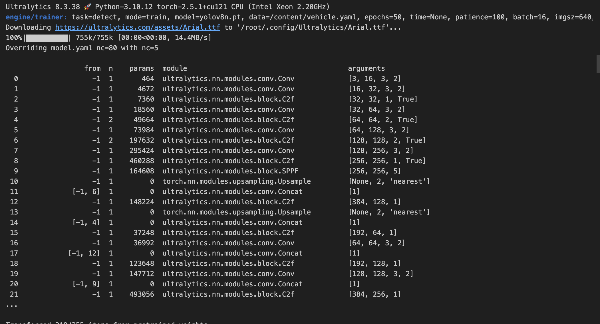
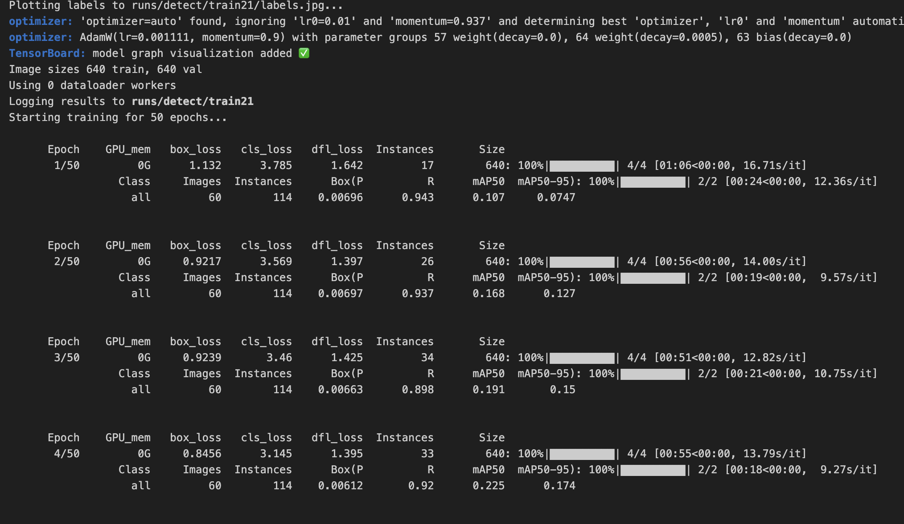
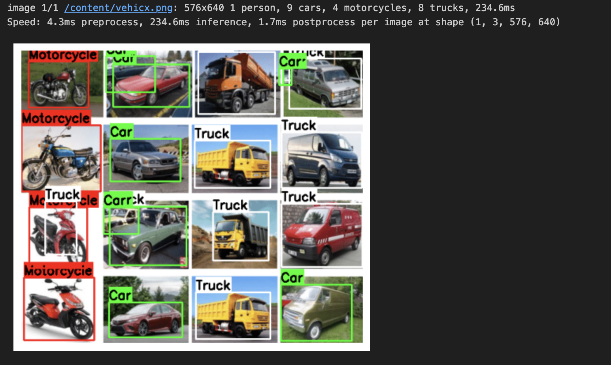

# Training-A-Deep-Learning-Model-with-the-Annotated-Images

# 🚗 Vehicle Detection using YOLOv8

This project demonstrates training a **YOLOv8 object detection model** on a custom vehicle dataset.  
The model is trained to detect the following classes:

- 🏍️ Motorcycle  
- 🚗 Car  
- 🚚 Truck  
- 🛵 (Extendable to more classes if needed)

---

## 📌 Project Overview

1. **Dataset Preparation**  
   - Images were annotated using [LabelImg](https://github.com/heartexlabs/labelImg).  
   - Annotations saved in YOLO format (`.txt` files with bounding box coordinates).  

2. **Training**  
   - Model: `yolov8n.pt` (YOLOv8 Nano, pretrained on COCO).  
   - Config: `vehicle.yaml` containing dataset paths and class names.  
   - Hyperparameters:  
     - Epochs: `50`  
     - Batch size: `16`  
     - Image size: `640x640`  

3. **Evaluation & Inference**  
   - Metrics tracked: `mAP@50`, `mAP@50-95`, precision, recall.  
   - Inference performed on sample images with bounding boxes drawn for each detected class.  

---

## 📸 Screenshots  

### 🔹 Model Architecture  
  

### 🔹 Training Progress  
  

### 🔹 Inference Results  
  


## 🛠️ Installation & Setup

Clone the repository and install dependencies:

```bash
git clone https://github.com/yourusername/vehicle-detection-yolov8.git
cd vehicle-detection-yolov8

pip install ultralytics opencv-python matplotlib pandas

